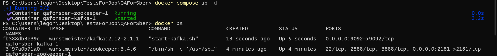
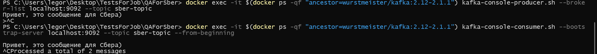
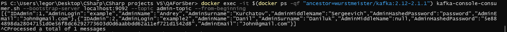

# Задания QA в Сбер
1) поднять в докере apache kafka
2) реализовать по, которое будет слушать Rest и класть в apache kafka
3) кинуть сообщение в Rest, проверить, что оно появилось в Кафке
4) реализовать тест на Gatling для rest вызовов

## Поднять в докере apache kafka:
1. Создаём конфигурационный файл docker-compose.yml и прописываем конфигурацию для Apache Kafka 
2. docker-compose up -d --Поднимаем кафку в докере

### Проверим работу Кафки:
    - Создадим топик sber-topic 
        docker exec -it $(docker ps -qf "ancestor=wurstmeister/kafka:2.12-2.1.1") kafka-topics.sh --create --topic sber-topic --zookeeper zookeeper:2181 --partitions 1 --replication-factor 1
    - Посмотрим список топиков
        docker exec -it $(docker ps -qf "ancestor=wurstmeister/kafka:2.12-2.1.1") kafka-topics.sh --list --zookeeper zookeeper:2181
    - Добавим сообщение в топик
        docker exec -it $(docker ps -qf "ancestor=wurstmeister/kafka:2.12-2.1.1") kafka-console-producer.sh --broker-list localhost:9092 --topic sber-topic
        Привет, это сообщение для Сбера)
    - Проверим, добавлено ли сообщение
        docker exec -it $(docker ps -qf "ancestor=wurstmeister/kafka:2.12-2.1.1") kafka-console-consumer.sh --bootstrap-server localhost:9092 --topic sber-topic --from-beginning

## Реализовать по, которое будет слушать Rest и класть в Apache Kafka
Напишем web api C# для админов(например)
Прим. Сделаем акцент на работе с кафкой, уберём из внимания вопросы аутентификации и авторизации. В т.ч с jwt-токенами.
Все взимодействия с бд my-sql производятся с удалённым сервером, запустив и настроив виртуальную машину на cloud.ru

Для отправки сообщений в кафку при запросе нужно:

    - Установить NuGet пакет Confluent.Kafka
    - Добавить кафку в appsettings.json
                "Kafka": {
            "BootstrapServers": "localhost:9092",
            "Topic": "admin-topic"
            }
    - Изменить методы в контроллере(добавим отправку сообщений в кафку)
Для отправки запросов используется postman.

Отправим Get-запрос и зайдём в кафку по выполнению запроса. Прочитаем сообщение, которое пришло в наш admin-topic:

